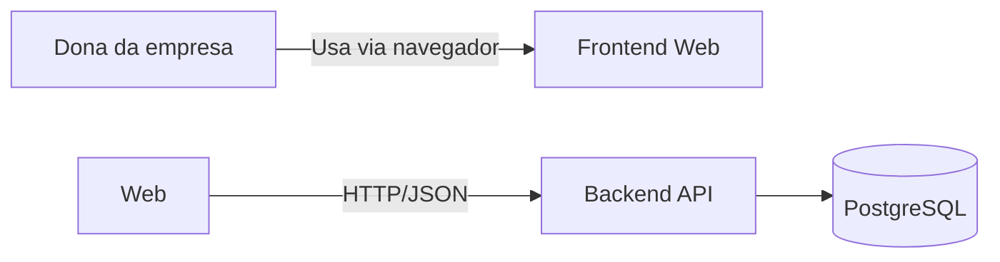
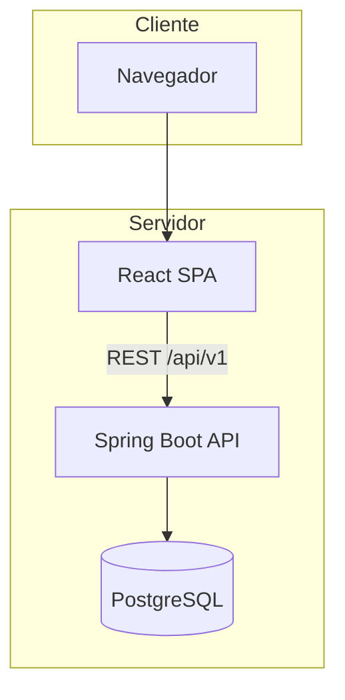
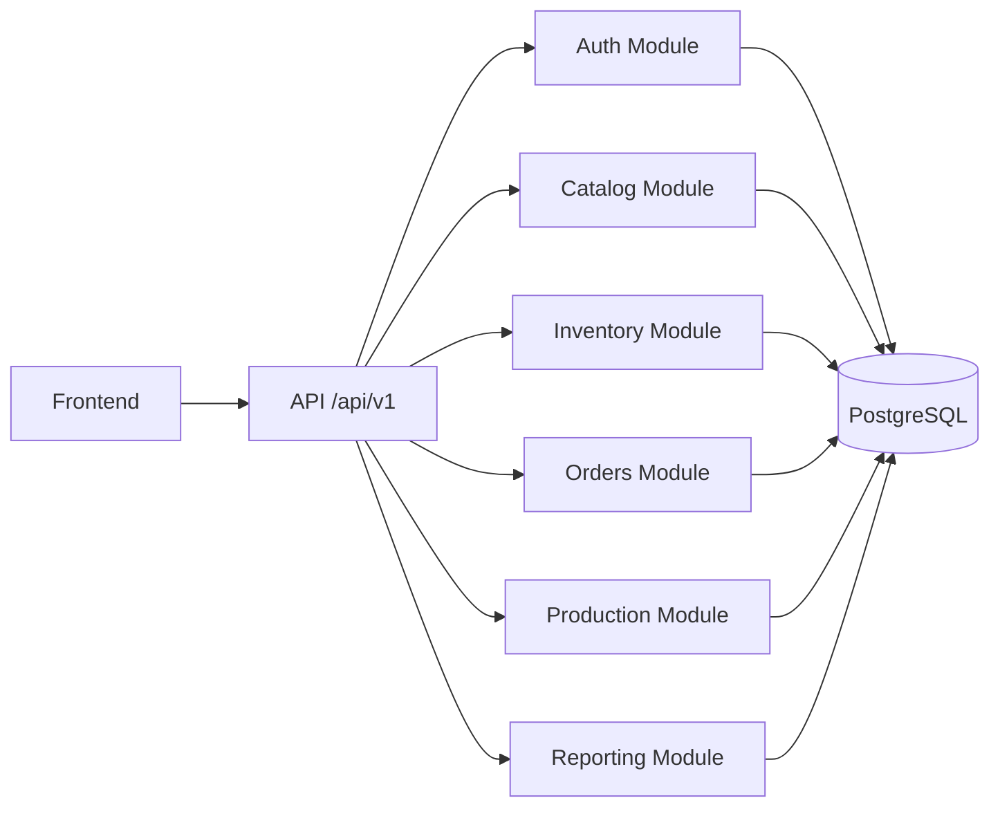
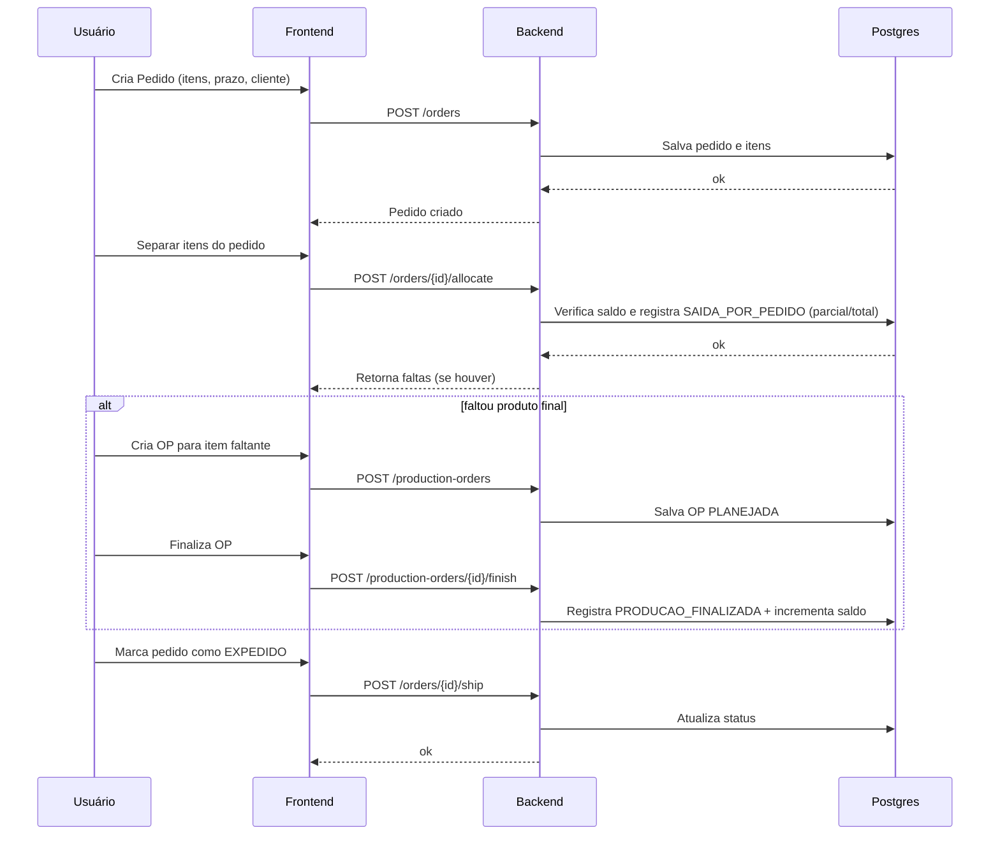

# Arquitera

> Domínio e dados: ver [04-dominio-e-dados.md](04-dominio-e-dados.md)
> API e contratos: ver [05-api-e-contratos.md](05-api-e-contratos.md)
> Segurança: ver [06-seguranca.md](06-seguranca.md)
> Infra: ver [07-infra-devops-observabilidade.md](07-infra-devops-observabilidade.md)

## Estilo Arquitetural
**Monólito modular** (MVP)
- Motivo: 1 empresa, 1 usuário, foco em time-to-market e baixo custo operacional.
- Modularidade reduz acoplamento e facilita evoluir para integrações e novos usuários.

## Estrutura de monorepo (proposta)
- apps/backend/
- apps/frontend/
- packages/shared/ (tipos/contratos gerados/ opcional)
- infra/
- docs/

## Organização interna (backend)
- `modules/auth`
- `modules/catalog`
- `modules/inventory`
- `modules/orders`
- `modules/production`
- `modules/reporting` (queries/exports)
- `shared/` (config, errors, utils)

Camadas por módulo:
- `api` (controllers + DTOs)
- `application` (use cases/services)
- `domain` (entidades/regras)
- `infra` (repos, db, external)

## C4 - Contexto (C1)
Sistema: "Gestão de Estoque e Produção"
- Usuário: Dona da empresa (Web)
- Sistema: App Web + API + Banco Posgres

## C4 - Container (C2)
- Frontend Web (React)
- Backend API (Spring Boot)
- Banco de Dados (PostgreSQL)
- Observabilidade (logs + health endpoints)

## C4 - Componentes (C3) - Backend (alto nível)
- Auth: login, sessão/JWT, rate limit
- Catalog: CRUD itens
- Inventory: movimentações, saldos, mínimos
- Orders: pedidos, separação, status
- Production: OP, status, finalização (entrada em estoque)
- Reporting: queries para relatórios e alertas

## Fluxos (Mermaid)
Fluxo: Pedido → Separação → Produção (se faltar) → Expedição

## Principais decisões
- Monólito modular (ADR-0001)
- Postgres como fonte de verdade + movimentações para auditoria (ADR-0002)
- Deploy via Docker Compose em VPS com backups cloud (ADR-0003)
- API REST versionada /api/v1 (ADR-0004)

**Manutenção:** mantenha diagramas C4 e fluxos atualizados sempre que adicionar módulos (ex.: integrações, usuários).